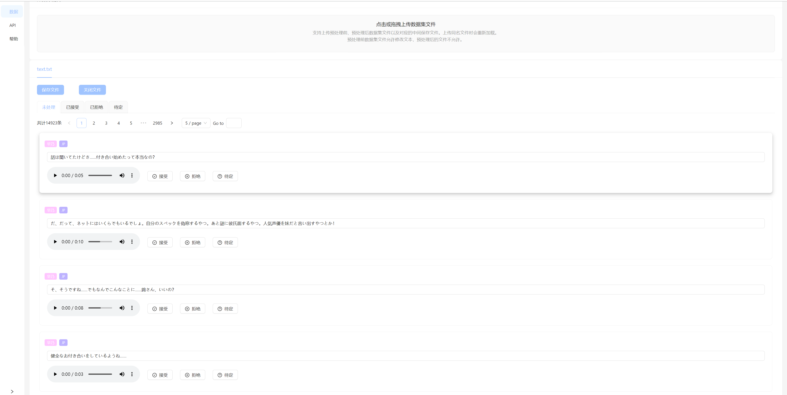

    
    <h1>Hiyori UI for BertVits2</h1>
    

      
      
    

## 简介
BertVits2的前端界面

## 效果预览
### 推理界面

### 数据集筛选界面

## 特点
+ 动态加载、卸载模型：更换模型无需重启。
+ 同时加载、推理多个模型：便于对比多个模型的语音效果。
+ 支持同一个模型重复加载：便于对比相同模型的不同参数对生成效果的影响。
+ 支持双盲测试：模型卡片自动洗牌并遮盖信息，盲听比较模型效果。

## 使用方法
+ **请以Release中对应的README.MD为准**
+ 下载Release，并将Release中的`Web`文件夹添加至BertVits2项目根目录
+ 配置`BertVits2`中的`config.yml`中的`server`配置
+ 运行`BertVits2`中的`server_fastapi.py`

## `BertVits2`版本说明
+ 对应版本`2.2` [release](https://github.com/fishaudio/Bert-VITS2/releases/tag/v2.2)
+ 请将本项目的`release`包解压后复制到`Bert-Vits2`项目根目录并替换所有文件，或者直接拉取[459635 commit](https://github.com/fishaudio/Bert-VITS2/commit/45963d595eb57953a5f6676817d5fb00328d5223)

+ 由于没有权限鉴定，请勿将网页服务对外开放。

#### ver 0.7.0 更新
+ 匹配新版本后端接口
+ 支持2.2模型推理。当使用`作为emo音频`选项时，`prompt`会无效。即emo音频的优先级更高。

#### ver 0.6.0 新增/破坏性变更
+ 匹配新版本后端接口
+ 支持2.1模型emo推理

#### ver 0.5.0 新增
+ 添加数据集处理界面

#### ver 0.4.1 新增
+ 界面优化
+ 添加了盲选功能
+ 添加了随机说话人功能

#### ver 0.4.0 破坏性变更
+ 音频api改为post，从而实现更长文本的切分生成。不支持`2023/11/9`之前`release`的bertvits

#### ver 0.3.5 新增
+ 添加了自动切分与自动翻译功能。

#### ver 0.3.4 新增
+ 添加了帮助页面

#### ver 0.3.3 新增功能
+ 从训练文件中获取随机音频示例

#### ver 0.3.2 优化
+ 优化模型选择框，较多模型时不再加载卡顿
+ 优化1080p以及2k界面

#### ver 0.3.1 新增功能
+ 模型卡片说话人允许使用搜索选择

#### ver 0.3 新增功能
+ 优化加载模型、卸载模型与推理时的交互，避免重复触发请求。
+ 允许选择模型搜索目录
+ 全局说话人允许使用搜索选择

### 功能说明
#### ver 0.2.2 修复
+ 状态栏显示修复

#### ver 0.2.1 修复
+ 音频下载文件名修改正确

#### ver 0.2 新增功能
+ UI优化
+ 添加全局设置面板

#### ver 0.1.1 新增功能
+ 音频下载，默认命名为`文本@模型名.wav`
+ 侧栏收缩，对于低分辨率更为友好的界面
+ 加载提示