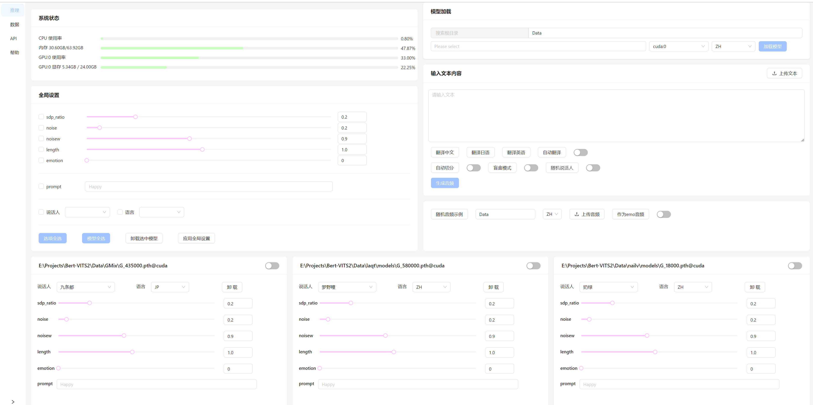

# Hiyori UI for BertVits2

## 简介
BertVits2的前端界面

## 效果预览

## 特点
+ 动态加载、卸载模型：更换模型无需重启。
+ 同时加载、推理多个模型：便于对比多个模型的语音效果。
+ 支持同一个模型重复加载：便于对比相同模型的不同参数对生成效果的影响。
+ 支持双盲测试：模型卡片自动洗牌并遮盖信息，盲听比较模型效果。

## 使用方法
+ 下载Release，并将Release中的`Web`文件夹添加至BertVits2项目根目录
+ 配置`BertVits2`中的`config.yml`中的`server`配置
+ 运行`BertVits2`中的`server_fastapi.py`

## 施工中...